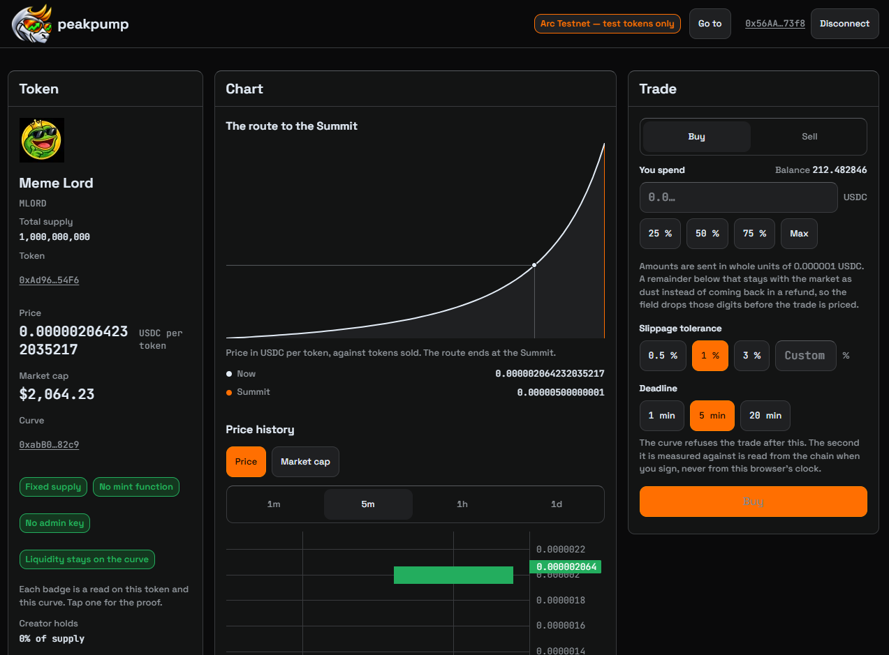

# peakpump

peakpump is a bonding-curve launchpad on the Arc Testnet. A market is a single
bonding curve: it climbs a fixed-price ASCENT phase to the Summit, then trades
in PEAK. Every quote is computed on chain and every fee is credited to a ledger
the recipient pulls from.

This repository contains the contracts, the web front end, the indexer and the
shared packages. It is testnet software: the tokens and balances it shows have
no monetary value.

## Live demo

https://peakpump.vercel.app

Try it on Arc Testnet. Connect your wallet, buy or sell tokens on the bonding
curve, and watch markets move through ASCENT toward PEAK.



## Deployed contracts

Arc Testnet, chain id 5042002. Deployed at block
[59806903](https://explorer.testnet.arc.io/block/59806903).

| Contract | Address |
| --- | --- |
| PeakpumpFactory | [0xfEe1364fB456c82d56Bb0344ea4A1082bD527a1e](https://explorer.testnet.arc.io/address/0xfEe1364fB456c82d56Bb0344ea4A1082bD527a1e) |
| Curve (implementation) | [0x518b65B9ADD8E7F64Bc7e6a6035bEC7B87CbaeA6](https://explorer.testnet.arc.io/address/0x518b65B9ADD8E7F64Bc7e6a6035bEC7B87CbaeA6) |
| PeakToken (implementation) | [0xfB8aCd178bfaf54488Be91d64AFC6F9d636b6972](https://explorer.testnet.arc.io/address/0xfB8aCd178bfaf54488Be91d64AFC6F9d636b6972) |
| FeeVault | [0xFA715612B06a50F82C1A00931df18215f0fE8ea8](https://explorer.testnet.arc.io/address/0xFA715612B06a50F82C1A00931df18215f0fE8ea8) |

The deployment record, including the compiler version and optimizer settings,
is in [contracts/deployments/arc-testnet.json](contracts/deployments/arc-testnet.json).

## Layout

- `contracts/` — Foundry project for PeakpumpFactory, PeakToken, Curve, FeeVault.
- `packages/shared` — shared types, chain definition and utilities.
- `packages/contracts-abi` — generated ABIs consumed by the app and indexer.
- `packages/indexer` — chain indexer.
- `packages/ui` — shared UI components.
- `apps/web` — the web front end.
- `docs/` — the authoritative specifications.
- `scripts/` — read-only reconciliation against the live deployment.

## Authority

`docs/MATH.md` is the mathematical authority, `docs/SPEC.md` the behavioural
authority and `docs/DESIGN.md` the visual authority. Code never re-derives what
these documents state, and where code and a document disagree the document wins.

## Fee schedule

One rate, flat in both phases and never tiered: **125 basis points total**,
split **30 bps to the creator and 95 bps to the protocol, with nothing to
liquidity providers**. The split is taken top-down in one pass — the total is
rounded up, the creator share is rounded down, and the protocol takes what
remains, so the two parts always sum to the whole. When the rounded total is
zero no fee call is made at all.

Fees are never pushed. Each one is credited to the FeeVault against the pair it
belongs to, and the creator pulls a balance with `claim()`. An outbound credit
that the vault cannot honour is never created: remainders too small to divide
into a credited balance stay as protocol dust.

## Prerequisites

- Node 22 or later, and pnpm 9.12 (the version `packageManager` pins).
- Foundry, for `forge build` and `forge test`.
- Docker, only if you run the indexer.

## Running the repo

Clone with submodules, or the contracts will not compile:

```
git clone --recurse-submodules <this repository>
```

Install:

```
pnpm i
```

The ABI package, the third-party notices, the differential test vectors and the
icon renditions are all generated rather than hand-maintained. Regenerate them
after a contract change or a dependency upgrade:

```
pnpm gen:abi
pnpm gen:notice
pnpm gen:vectors
pnpm gen:icons
```

Contracts:

```
cd contracts
forge build
forge test
```

Web app — the type check and the unit tests run against every package through
turbo, and the build is what produces the bundle the deploy ships:

```
pnpm typecheck
pnpm test
pnpm build
pnpm --filter @peakpump/web dev
```

The web app needs its environment before it serves anything useful. Every key
is listed in [apps/web/.env.example](apps/web/.env.example) with the value it
expects and the consequences of leaving it empty; copy that file to
`apps/web/.env.local` and fill it in. The indexer needs its own token, listed in
[packages/indexer/.env.example](packages/indexer/.env.example).

Fee reconciliation against the live deployment is a read-only script that never
signs and never broadcasts:

```
tsx scripts/reconcile-fees.ts
```

It prints two reconciliations — internal solvency of the vault and attribution
of the creator split — and reports the fee split as unverified when the RPC it
reaches cannot serve the deployment window. Set `ARC_RPC_URL` to point it at one
host.

## Licence

MIT. See [LICENSE](LICENSE).
